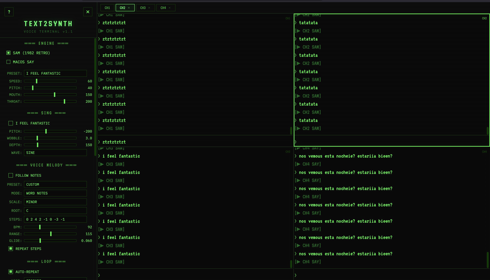

# TEXT2SYNTH

Sintetizador retro de texto a voz con interfaz web tipo terminal, backend Flask y motor Web Audio multipista.

TEXT2SYNTH convierte texto en voz, efectos y secuencias melódicas por palabra/frase con estética de síntesis clásica.



## Estado actual (resumen)

- Hasta 4 canales independientes.
- Motor de audio compartido con efectos por canal.
- Motores de voz detectados automáticamente según sistema operativo.
- UI muestra solo motores disponibles en ese host.
- `MELODY` separado de `WOBBLE` para notas más claras.
- Fallback robusto en `espeak/espeak_ng` cuando una voz falla.

## Motores de síntesis soportados

Actualmente hay 4 engines en el backend:

1. `sam`
- Base: `samtts` (Python).
- Enfoque: timbre retro 8-bit (Software Automatic Mouth style).

2. `say` (solo macOS)
- Base: comando `say` + conversión con `afconvert`.
- Enfoque: voces de sistema de macOS.

3. `espeak`
- Base: binario `espeak`.
- Enfoque: TTS clásico, rápido y experimental.

4. `espeak_ng`
- Base: binario `espeak-ng`.
- Enfoque: variante modernizada de eSpeak con más voces/opciones.

Notas importantes:
- El backend detecta disponibilidad real y expone `available_engines`.
- El frontend habilita/oculta motores según esa lista.

## Detección y fallback de voces

Para `espeak` y `espeak_ng`:

- El selector usa IDs válidos de voz (por ejemplo `en-us`, `fr-fr`).
- También soporta valores viejos guardados por nombre descriptivo (por ejemplo `French_(France)`) y los mapea internamente al ID correcto.
- Si una voz listada falla para cierto texto/script, el backend hace fallback automático a `en` para no cortar la reproducción con error 500.

## Instalación

```bash
git clone https://github.com/vlasvlasvlas/text2synth.git
cd text2synth
python3 -m venv venv
source venv/bin/activate
pip install -r requirements.txt
```

## Dependencias Python

`requirements.txt`:

- `flask`
- `flask-cors`
- `pyyaml`
- `samtts`
- `pyttsx3` (quedó como dependencia opcional de compatibilidad/futuro, no es engine activo principal hoy)

## Dependencias por OS

### macOS

- `say` y `afconvert` vienen con el sistema.
- Para `espeak/espeak_ng`:

```bash
brew install espeak-ng
```

### Linux (Debian/Ubuntu)

```bash
sudo apt update
sudo apt install -y python3 python3-venv python3-pip espeak-ng
```

### Windows

- `sam` funciona con Python + `samtts`.
- `say` no aplica.
- `espeak/espeak_ng` requieren binario en `PATH`.

## Ejecutar

```bash
source venv/bin/activate
python server.py
```

Abrir:

```text
http://localhost:5050
```

## Uso de MELODY (claro y directo)

Si querés que “cante notas” de forma clara:

1. Elegí un engine (`sam`, `say`, `espeak` o `espeak_ng`).
2. Activá `MELODY`.
3. Poné `MODE = NOTES PER WORD`.
4. Definí `STEPS` (ejemplo: `0 2 4 7 4 2 0`).
5. Dejá `RANGE` cerca de `100` para una lectura fiel del patrón.
6. Desactivá `WOBBLE` si querés notas limpias.

Cómo se interpreta:

- `STEPS`: patrón melódico (grados o notas).
- `RANGE`: escala la amplitud de intervalos (100 = referencia natural del patrón).
- `GLIDE`: suaviza transiciones entre notas.
- `BPM`: afecta principalmente modo `BEND WHOLE PHRASE`.

## Controles que suelen confundir

- `SPEED` (en motores de voz): velocidad de lectura.
- `SPEED*` en SAM: en SAM clásico, valores más bajos suelen sonar más rápido.
- `SHIFT` (WOBBLE): transposición base en cents.
- `RANGE` (MELODY): profundidad intervalar del patrón.

## API

### `GET /api/voices`

Devuelve, entre otros:

- `available_engines`
- `engine_meta`
- voces por engine (`say`, `espeak`, `espeak_ng`)
- presets `sam` desde `config.yaml`

### `POST /api/synthesize`

Entrada típica:

```json
{
  "text": "I feel fantastic",
  "engine": "sam"
}
```

Parámetros varían por engine (`speed`, `pitch`, `voice`, etc.).

## Configuración

`config.yaml` controla:

- presets SAM
- voces preferidas de `say`
- presets de melodía
- defaults de engine/FX/loop/melody

## Origen / inspiración

- S.A.M. (1982): Software Automatic Mouth.
- Voces de sistema de macOS (`say`).
- Estética de experimentación vocal retro + procesamiento musical en tiempo real.

## Licencia

MIT (`LICENSE`).
